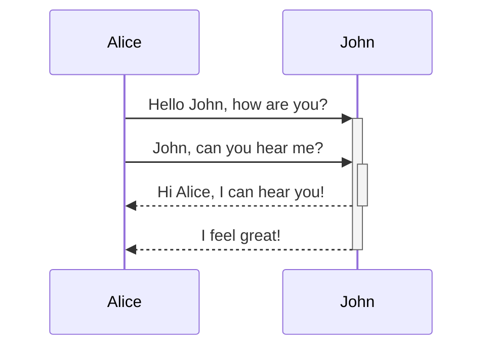

# Obsidian

## Raccourcis clavier

- Ouvrir la palette de commande : `CTRL + P`
- Créer une nouvelle note : `CTRL + N`
- Revenir en arrière / en avant : `CTRL + ALT + Flèches`
- Créer plusieurs curseur : `ALT + clic`
- Ouvrir un fichier dans un nouveau volet : `CTRL + clic`
- Ouvrir le sélecteur rapide : `CTRL + O`
- Lancer la recherche : `CTRL + MAJ + F`

## Formatage

Syntaxe spécifique d' Obsidian à utiliser en plus de la syntaxe markdown classique.

### Liens

#### Lien interne

```
[[Lien interne]]
[[lien interne |Nom affiché]]
```

#### Lien vers un titre

```
[[Lien interne#titre]]
```

Lors de la saisie semi-automatique, lorsque la note recherchée est mise en surbrillance, appuyer sur `#` au lieu de `Entrée` , pour avoir la liste des titres de premier niveau de la note. Appuyer à nouveau sur `#` pour afficher les sous-titres

#### Lien vers un bloc

Un bloc peut être :

- un paragraphe
- Une citation
- Un élément de liste
- Un bloc de code

```
[[lien interne^id-bloc]]
```

Lors de la saisie semi-automatique, appuyer sur `^` pour rechercher le bloc. Un identifiant (commençant par `^` ) est automatiquement ajouter à la suite du bloc (Non visible en mode aperçu). Il est également possible de créer manuellement un identifiant pour un bloc.  
Attention : Ce type de lien ne peut être reconnu que par Obsidian.  
Remarque : Il est possible d'intégrer le bloc comme n'importe quel fichier avec la syntaxe `![[lien interne^id-bloc]]`

### Callout blocks

```
> [!INFO]
> Here's a callout block.
> It supports **markdown** and [[Internal link|wikilinks]].
```

```
> [!INFO] callout avec un titre
```

On peut créer des callout pliables en ajoutant `+` (par defaut déplié) ou `-` (par défaut plié) juste après le type du block

```
> [!note]- callout pliable 
> Contenu
```

Les types de callout (Le nom n'est pas sensible à la casse)

- Note => bleu foncé - icone "crayon"
- Summary => bleu clair - icone "fiche"
- Info => bleu clair - icone "i"
- Todo => bleu clair - icone "coche"
- Tip / important => vert bleu - icone "flamme"
- Success / Check / Done => vert clair - icone "coche"
- Question => vert pomme - icone "point d'interregation"
- warning, attention => orange - icone "panneau signalisation"
- failure, fail, missing => rouge clair - icone "croix"
- danger / error=> rouge foncé - icone "éclair"
- bug => rouge foncé - icone "bug"
- example => voilet - icone "liste"
- quote, cite => gris - icone "quote"

### Intégrer du contenu

Les formats de fichiers reconnus sont :

- Image : `png`, `jpg`, `jpeg`, `gif`, `bmp`, `svg`
- Audio : `mp3`, `webm`, `wav`, `m4a`, `ogg`, `3gp`,`flac`;
- Video : `mp4`, `webm`, `ogv`
- Autres : `md`, `pdf`

#### Fichier

 Utiliser : `![[nom-fichier]]`  
On peut aussi intégrer une note avec la même syntaxe

#### Pdf

Pour les fichiers PDF, il est possible d'indiquer la page ouverte par défaut avec la syntaxe `![[file.pdf#page=number]]`

#### Redimensionner les images

Syntaxe : `![[image.png|100x100]]`  
Pour que l'image garde ses proportions il faut indiquer que la largeur : `![[image.png|100]]`

#### Intégrer du contenu web

On peut utiliser la balise HTML `<iframe>`

```html
<iframe 
	border=0
    frameborder=0
    height=250
    width=550
	src="INSERT YOUR URL HERE">
</iframe>
```

### Autres

#### Surligné

```md
==text surligné ==
```

#### Tags

Pour créer un tag : `#nom-tag`  
Il est possible de créer des tags imbriqués : `#nom-tag/sous-tag`  
Attention :

- le nom ne peut pas contenir d'espace
- Les chiffres sont autorisés, mais le nom doit obligatoirement contenir au moins une lettre. (Le nom ne peutpas être purement numérique)
- Les seuls symboles autorisés dans le nom sont le tiret `-` et l'underscore `_`

#### Uri obsidian

En utilisant un chemin de fichier

```md
[Link to note](obsidian://openpath=D:%2Fpath%2Fto%2Ffile.md)
```

En utilisant le nom du vault et le nom du fichier

```md
[Link to note](obsidian://openvault=MainVault&file=MyNote.md)
```

#### Math

```md
$$\begin{vmatrix}a & b\\
c & d
\end{vmatrix}=ad-bc$$
```

Il est possible également d'écrire une formule en ligne en la délimitant par des `$`  
Exemple : $e^{2i\pi} = 1$

#### Diagramme

Obsidian utilise [Mermaid](https://mermaid-js.github.io/)

<pre><code>```mermaid
sequenceDiagram
	Alice->>+John: Hello John, how are you?
	Alice->>+John: John, can you hear me?
	John-->>-Alice: Hi Alice, I can hear you!
	John-->>-Alice: I feel great!
```</code></pre>



[Editeur Mermaid en ligne](https://mermaid-js.github.io/mermaid-live-editor)

## Recherche

<https://help.obsidian.md/Plugins/Search>

### Syntaxe

- `foo bar` : recherche les notes contenant à la fois` foo` et `bar`
- `"chaînes entre guillemets"` : Recherche la chaine exact.
- `foo OR bar` : recherche les notes contenant l'un des termes
-     `foo -bar` : recherche les notes contenant `foo`, sauf si elles contiennent aussi `bar`
-     `/regex/` : Recherche les notes contenant l'expression régulière

Remarque : on Peut utiliser aussi des parenthèses pour regrouper les opérations booléennes  
.

### Filtres

- `file:` Recherche dans le nom de fichier. Exemple : `file:".jpg"`, `file("to be" OR -"2B")`
- `path:` Recherche dans le chemin du fichier, absolu depuis la racine. Exemple: `path:"Daily Notes/2020-07"`

## Vue graphique

<https://help.obsidian.md/Plugins/Graph+view>

Les notes les plus référencées apparaissent sous forme de nœuds plus gros sur le graphique.

**Conseils de visualisation**

- survoler chaque nœud pour mettre en évidence ses connexions, en atténuant tout le reste.
- Faire glisser les nœuds pour réorganiser le graphique. Cela peut être utile si certains nœuds se superposent à d'autres.

**Conseils de navigation**

- Pour zoomer, utiliser la molette de la souris, ainsi que les touches `+` et `-`.
- Pour se déplacer, faire glisser l'arrière-plan ou utiliser les touches fléchées du clavier. (Maintenir la touche `MAJ` pour accélérer le déplacement avec le clavier)

## Modèles

Permet d'insérer rapidement des extraits de texte dans la note actuelle

### Configuration

- Créer un dossier pour les modèles
- Activer le plugin *Templates* et indiquer le dossier à utiliser :* Paramètres -> Modèles -> "Emplacement du dossier de modèle"*
- Dans les réglages du plugin, choisir un format de date et heure.

### Utilisation

Chaque extrait de modèle est une note de markdown normale dont le contenu sera inséré à la position actuelle du curseur.  
Pour insérer : cliquer sur le bouton sur la gauche ou utiliser la commande palette (on peut également configurer un racourci clavier)

### Insérer la date et l'heure

Dans le fichier modèle utiliser :

- `{{date}}`
- `{{time}}`

Il est possible d'utiliser un format personnalisé. Ex :

- `{{date:YYYY-MM-DD}}`
- `{{time:HH:mm}}`

## Utiliser les métadonnées (yaml)

A indiquer en début de fichier

```
---
key: value
key2: value2
key3: [one, two, three]
key4:
- four
- five
- six
---
```

Actuellement , trois clés sont nativement supportés: `tags`, `aliases`et `cssclass`.

### Tags

```
tags: [nom-tag-1, nom-tag-2]
```

### Alias

<https://help.obsidian.md/How+to/Add+aliases+to+note>

Permet de faire référence au même fichier avec des noms différents.

```
---
aliases: [nom-alias-1, nom-alias-2]
---
```

ou

```
aliases:
- nom-alias-1
- nom-alias-2
```

On peut ensuite indiquer `[[nom-alias]]` pour créer un lien vers la page dont on a défini un alias. Une icône de redirection apparait dans la liste de saisie semi-automatique. Le lien inséré sera au final sous la forme `[[nom-fichier |nom-alias]]`

Il est également possible d'utiliser l'alias pour rechercher les occurrences non liées dans le panneau des rétroliens

### Classes css

Il est possible d'utiliser des classes CSS spécifique à une note (appliqué sur l'ensemble du contenu)  
Ces classes doivent être définies dans le fichier CSS du thème

```
cssclass: [#nom-classe-1, #nom-classe-2]
```

## Créer un thème css personnalisé

À placer dans le répertoire des thèmes du vault.  
`VAULT/.obsidian/themes/CUSTOM_THEME.css`

Puis activer le thème :  
*Settings -> Appearance -> Themes*

Il est également possible d'utiliser des fichiers extraits CSS, à stocker dans le dossier : `VAULT/.obsidian/snippet`

**Liens **

- [Common Selectors for Custom CSS](https://forum.obsidian.md/t/common-selectors-for-custom-css/1984)
- [Meta Post - Common CSS Hacks](https://forum.obsidian.md/t/meta-post-common-css-hacks/1978)
- [Getting comfortable with Obsidian CSS](https://forum.obsidian.md/t/getting-comfortable-with-obsidian-css/133)

## Compositeur de notes

[https://help.obsidian.md/Plugins/Note+composer](https://help.obsidian.md/Plugins/Note+composer)

Permet de fusionner deux notes ou extraite une partie de note dans une nouvelle note.

### Fusionner un fichier dans un autre

Aller dans le menu *Plus d'options* et sélectionner *Fusionner tout le fichier avec*  
Ou alors lancer la palette de commandes et chercher *Compositeur de notes : fusionner le fichier actuel*  
Remarques :

- La note actuelle sera par défaut fusionnée en bas. Utiliser `MAJ + ENTER` pour fusionner vers le haut
- Tous les liens vers la note qui a été fusionné seront mis à jour.

### Extraire

Sélectionner le texte à extraire puis faire un clic droit et sélectionner *Extraire la sélection actuelle*. Puis indiquer le fichier dans lequel effectuer l'extraction (ou en créer un nouveau). Un lien vers l'extrait sera inséré
